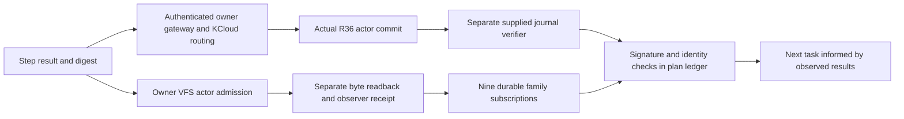

# Research and development report: batches 1–2

Date: 2026-10-07, Australia/Adelaide. **20 of 100 tasks completed; 80 remain. Next task: step 21.**

## Completion standard and bilateral application

Every completed step has an immutable result artifact, a returned VFS actor receipt, separate exact byte/SHA-256 readback and VFS observer receipt. Each result digest was also mapped, through its first 32 bits as the bounded execution nonce, into a real owner R36 transaction through the authenticated owner gateway. The supplied detached journal verifier ran in a separate process; all twenty returned signatures, exact transaction identities and actor receipt hashes were verified. All nine family subscriptions then mirrored all twenty artifacts, yielding 180 independently hashed research-result copies.

These are distinct producer/observer execution roles under the same owner on the current cloud host. They are not an external production assessment. Existing owner runtimes and retained state remain the actuation substrate. No simulation result is presented as physical energy production or multi-host availability.

## Step results

| Step | Status | Concrete result |
| --- | --- | --- |
| 1 | Completed | Exactly 100 unique tasks, ten batches and explicit acceptance/readback contracts. [Evidence](evidence/step-001.json) |
| 2 | Completed | All nine local HEADs matched their authenticated remote branch tips at the check. [Evidence](evidence/step-002.json) |
| 3 | Completed | Nine launcher source guards accepted the exact qualified engine and wheel bytes. [Evidence](evidence/step-003.json) |
| 4 | Completed | All fourteen original/control sources matched both local Library and private queue digests. [Evidence](evidence/step-004.json) |
| 5 | Completed | Nine live families; 27 distinct network namespaces; 171 healthy owner workstations. [Evidence](evidence/step-005.json) |
| 6 | Completed | All nine persistent bilateral cycle counters advanced during the measurement. [Evidence](evidence/step-006.json) |
| 7 | Completed | Nine gateways and VFS protected reads/mutations rejected missing authority with HTTP 401. [Evidence](evidence/step-007.json) |
| 8 | Completed | All nine cached owner bundles independently matched the final SHA-256. [Evidence](evidence/step-008.json) |
| 9 | Completed | Controlled-document check passed for eight standards and eleven controls. [Evidence](evidence/step-009.json) |
| 10 | Completed | Actual Python, SQLite, uv, Node, Docker and machine versions captured. [Evidence](evidence/step-010.json) |
| 11 | Completed | Primary CPython transaction documentation retrieved and SHA-256/git-blob fingerprinted. [Evidence](evidence/step-011.json) |
| 12 | Completed | Upstream SQLite WAL reader algorithm retrieved at an exact commit and fingerprinted. [Evidence](evidence/step-012.json) |
| 13 | Completed | Separate verification/delivery connections identified and a one-snapshot contract specified. [Evidence](evidence/step-013.json) |
| 14 | Completed | Five-repeat instrumented polling experiment at 100, 1,000 and 10,000 receipts captured. [Evidence](evidence/step-014.json) |
| 15 | Completed | Mutating an old receipt rejected both full-chain verification and later event delivery. [Evidence](evidence/step-015.json) |
| 16 | Completed | Ten invalid event/subscription boundaries rejected; acknowledged cursor survived reopen. [Evidence](evidence/step-016.json) |
| 17 | Completed | Old implementation delivered a deliberately corrupted row added after its verified snapshot. [Evidence](evidence/step-017.json) |
| 18 | Completed | Both VFS implementations now verify and select events in one explicit read transaction. [Evidence](evidence/step-018.json) |
| 19 | Completed | Ten native tests passed per VFS repository, including four new snapshot/boundary regressions. [Evidence](evidence/step-019.json) |
| 20 | Completed | Live managed VFS fingerprint matched selected source; event route and nine subscriptions recovered. [Evidence](evidence/step-020.json) |

## Research findings and implemented change

The original VFS event route verified the complete receipt chain, closed that connection, then selected delivery rows through another connection. In an isolated deterministic experiment, a concurrent writer appended and corrupted a row between those operations; the route returned that row despite having verified an earlier snapshot. This was controlled database-level fault injection, not an unauthenticated public attack.

Primary CPython documentation explains explicit transaction control with isolation_level=None. SQLite's WAL reader algorithm explains that the reader retains its original end-frame boundary and thereby sees a consistent snapshot while writers append. Those mechanisms support an explicit read transaction spanning both verification and event selection.

Both VFS repositories now use that transaction. Valid concurrent appends wait for the next poll; a deliberately corrupt concurrent append cannot enter the current response and causes the following poll to fail verification. Corrupted historical prefixes still reject later delivery. The original full-history integrity check remains intact.

The sources are fingerprinted in evidence/cpython-source.json and evidence/sqlite-source.json. The CPython document is from v3.12.12; the actual linked runtime reports Python 3.12.14 and SQLite 3.53.1. Source references explain the mechanism and are not asserted to be the build provenance of those binaries. The actual transaction behaviour was checked empirically.

## Measured scaling

| Retained receipts | Events returned | Median instrumented polling time | Peak traced Python allocation |
| --- | --- | --- | --- |
| 100 | 100 | 0.150 s | 161,390 bytes |
| 1,000 | 100 | 0.556 s | 774,290 bytes |
| 10,000 | 100 | 5.092 s | 7,306,730 bytes |

Each history size had five runs. These results include tracemalloc overhead and concurrent cloud workload; they establish neither production throughput nor a customer latency guarantee. The bounded delivery window still triggers full-history verification and allocation. The snapshot fix addresses consistency rather than claiming constant-time polling. Bounded verification/checkpoint design must preserve prefix integrity and is a separate future qualification.

## Recovery and newly discovered operating constraints

The first current-state check found that host controllers from the prior execution were absent, while Docker domains and durable state survived. Historical running evidence was therefore not reused as present readiness. The controllers were restored through the admitted owner CLI with their existing keys, journals, domain mounts and bilateral intent. Subsequent live health and advancing-cycle checks passed across all nine families.

Several domains had exited with code 137 and memory samples were near their 128 MiB ceiling. Existing explicitly owner-labelled domains received a recorded operational increase to 256 MiB. All 27 were running at readback, with zero additional restart-count increments observed during the measured recovery interval. This association supports the mitigation; the retained evidence does not establish the cause of every earlier exit. New-container factory code still defaults to 128 MiB. Resource policy, heap behaviour and sustained capacity need release-level qualification in the domain/capacity batch.

During restoration, an eight-second launcher/client deadline expired on domain readback while the underlying controller completed startup. The research observer used a bounded 60-second observation deadline, and controller-only restoration preserved existing admitted domains. Deadline consistency and startup settling remain explicit engineering work; no fresh-task or unattended-host reliability certification is claimed. The current task reports a four-core CPU quota and 32 GiB memory ceiling, making aggregate family capacity a measured requirement.

## Changed files and execution tools

Both private VFS repositories: vfs_server/store.py and vfs_server/tests/test_event_snapshot.py. The latter adds concurrent valid/invalid append, corrupted prefix and cursor-boundary coverage. Ten tests pass in each repository. Their native qualification workflows now pin checkout/setup actions to full revisions, declare read-only permissions, Ubuntu 24.04, bounded job duration and concurrency. Hosted execution remains separately evidenced. The qualified engine source and wheel remain unchanged.

Canonical engine repository: docs/research/PLAN_100.md and JSON ledger; immutable initial plan; per-step evidence and application receipts; scripts/research/baseline.py, vfs_experiments.py, qualify_vfs_deployment.py and apply_steps.py. The experiment runner obtains the exact historical pre-fix source from private Git rather than treating today's implementation as yesterday's baseline. The application runner accepts a step range and refuses duplicate execution of unchanged completed results. Subsequent applications additionally retain the full artifact digest in the bounded tenant identity; historical transactions and receipts are preserved.

## Remaining dependencies and continuation

Native Site source/publishing, Projects provisioning, Drive transfer, hosted billing-enabled CI, fresh-task restoration and independent production assessment remain explicitly pending in their numbered tasks. Their absence does not prevent local integrity, recovery, HCI, packaging and research work. Current results, implementation commits and actual readbacks are recorded separately.

**Next task: step 21 — trace bilateral intent persistence and actor acknowledgement crash boundaries, identify each recoverable prefix, and define the failure-injection points for batch 3.**
